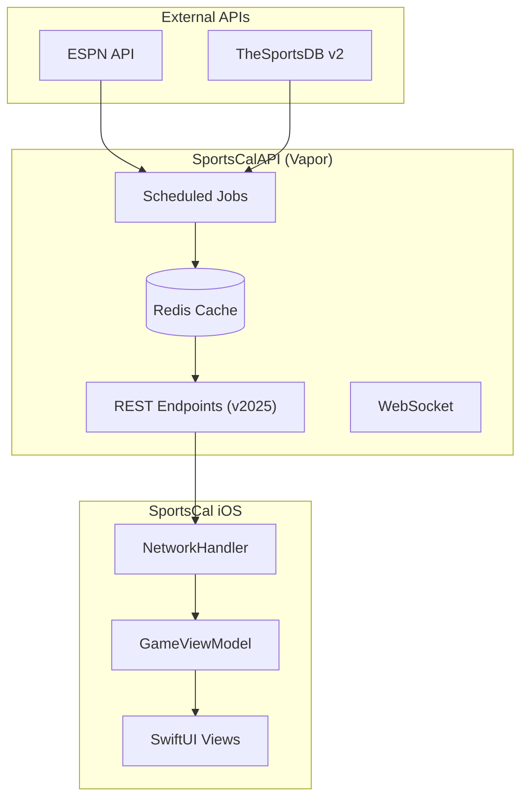

# SportsCal Architecture Documentation

This directory contains Mermaid diagrams documenting the SportsCal system architecture.

## Diagrams

### 1. System Overview (`overview.mmd`)

High-level view of all system components and their relationships.



### 2. Data Flow (`data-flow.mmd`)

Sequence diagram showing how data moves through the system, including:
- Live score updates (every minute)
- Schedule updates (every 6 hours)
- Client request/response flow
- WebSocket real-time updates

### 3. Data Models (`models.mmd`)

Class diagram of core data models:
- `LiveScore` - Container for all sports data
- `LiveEvent` - Events for a single sport
- `Game` - Individual game/match data
- `Leagues` - Enum of supported leagues
- `Team` - Team information

### 4. API Endpoints (`api-endpoints.mmd`)

Overview of all REST and WebSocket endpoints:
- Versioned endpoints (`/v2025/*`)
- Legacy endpoints (backward compatibility)
- Response headers for version checking

## Viewing Diagrams

### GitHub

GitHub natively renders `.mmd` files. Just click on any diagram file to view it.

### VS Code

Install the "Markdown Preview Mermaid Support" extension.

### Online

Use [Mermaid Live Editor](https://mermaid.live/) to paste and edit diagrams.

### Command Line

```bash
# Install mermaid-cli
npm install -g @mermaid-js/mermaid-cli

# Generate PNG
mmdc -i overview.mmd -o overview.png

# Generate SVG
mmdc -i overview.mmd -o overview.svg
```

## API Version Strategy

The API uses year-based URL path versioning:

| Version | Path | Status |
|---------|------|--------|
| 2025 | `/v2025/*` | Current |
| Legacy | `/*` | Deprecated (backward compat) |

### Version Headers

All responses include:
- `X-API-Version: 2025` - Current API version
- `X-Min-App-Version: 1.5.0` - Minimum iOS app version required

The iOS app checks these headers and shows an update prompt if the app version is below the minimum.

## JSON Response Optimization

The v2025 API removes unused fields to reduce response size by ~20%:

### Removed Fields (not sent)
- `strPlayer`, `idPlayer` - No player-level UI
- `intEventScore`, `intEventScoreTotal` - Legacy fields
- `updated`, `strEventTime`, `dateEvent` - Redundant timestamps

### Computed Fields (derived from `idLeague`)
- `strSport` - Computed from league enum
- `strLeague` - Computed from league enum

### Kept Fields
- `strHomeTeamBadge`, `strAwayTeamBadge` - Still sent (simpler than computing)
